# Docker образ для сборки прошивки Padavan для KIMAX BS-U35WF актуален на 26.11.2020 #
## Установка ##
```bash
git clone https://github.com/Honyrik/padavan_BS-U35WF.git
```
```bash
cd padavan_BS-U35WF
```
```bash
docker build -t padavan-local .
```
## Запуск ##
```bash
docker run -it -v `pwd`/dist:/opt/dist --name padavan-BS-U35WF-builder padavan-local
```
`pwd`/dist - любой путь до локальной папки куда будем перекладывать готовую прошивку, например c:\dist
## Сборка прошивки ##
- Запускаем ./start.sh и ждем загрузку зависимостей

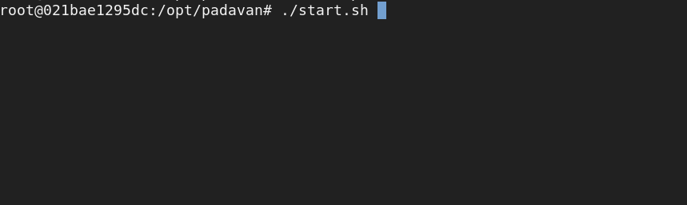
- Выбираем Padavan-ng, жмем 1 (1 - стабильная старая ветка не обновлялась почти год(26.11.2020), 2 - обновляется и самое новое сейчас можно ее (у меня стоит с нее))

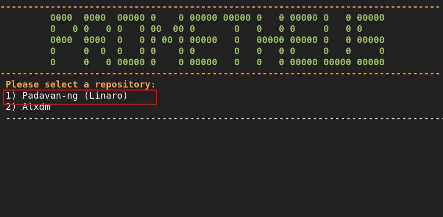
- Выходим из скрипта, Жмем Ctrl+C

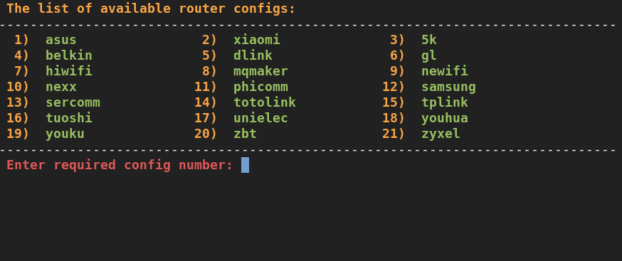
- Запускаем ./patch_BS-U35WF.sh

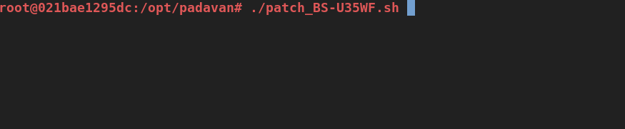
- Запускаем ./start.sh

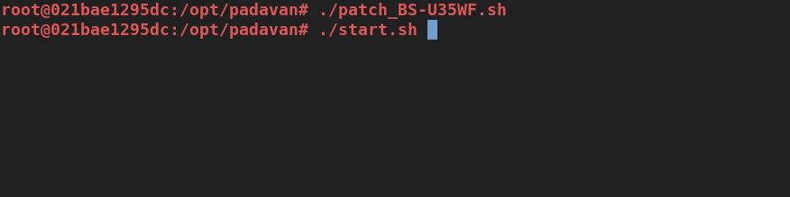
- Выбираем NEXX. Набираем 10 и жмем Enter.

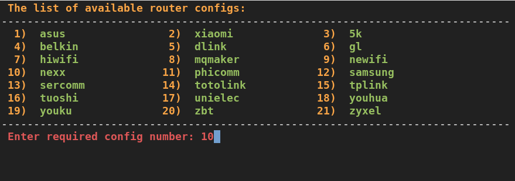
- Выбираем wt3020h. Набираем 1 и жмем Enter.

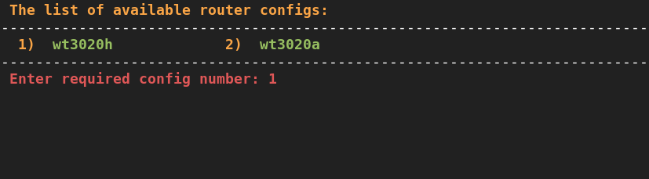
- Запускаем сборку toolchain. Набираем 3. (Занимает 20-30+ минут)

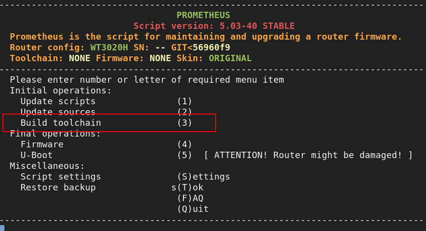
- Переходим в сборку прошивки. Набираем 4.

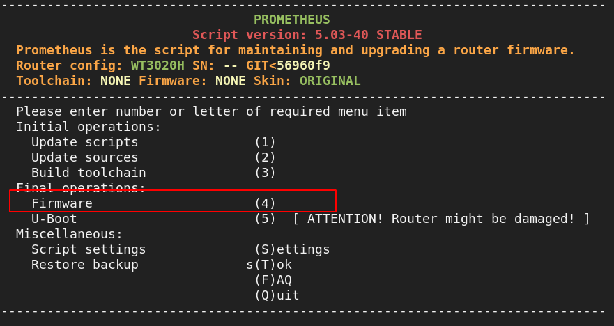
- Переходим в выбор тем. Набираем 2.

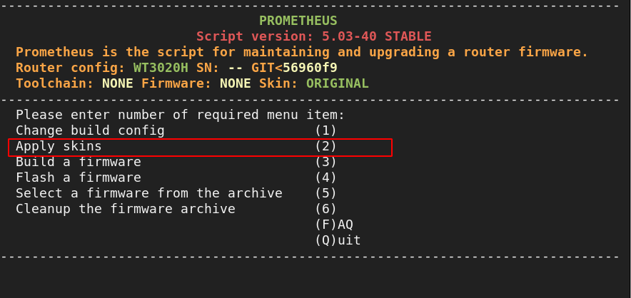
- Набирем последовательно 0 1 2 3 4 5 6. Жмем Shift+Q для возрата

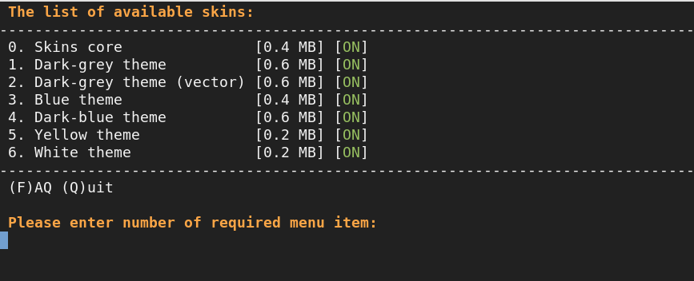
- Собираем ядро. Набираем 3. (Занимает 20-30+ минут)

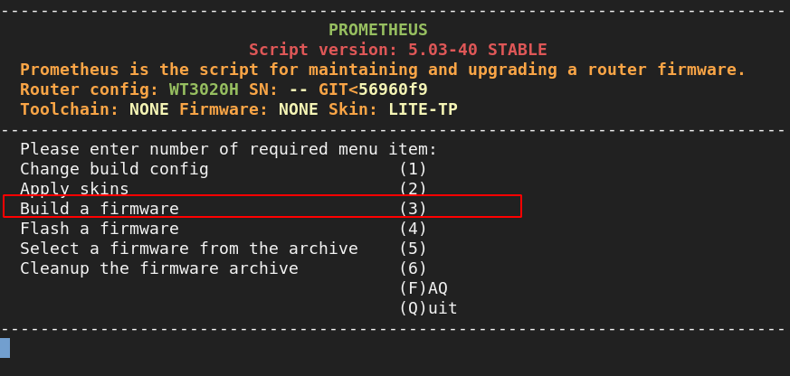
- После успешного сборки запоминаем название сборки и выходим из скрипта. Дважды жмем Shift+Q.

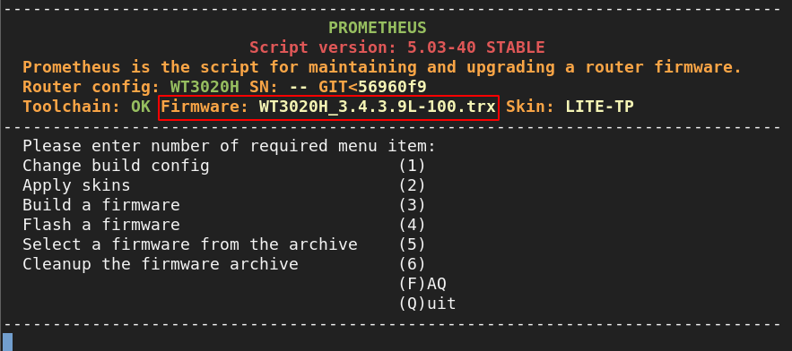
- Копируем сборку в папку /opt/dist. После этого на локальной в папке будет доступна прошивка которую можно залить на устройство

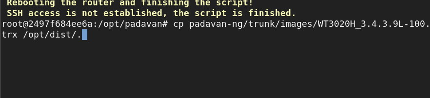
